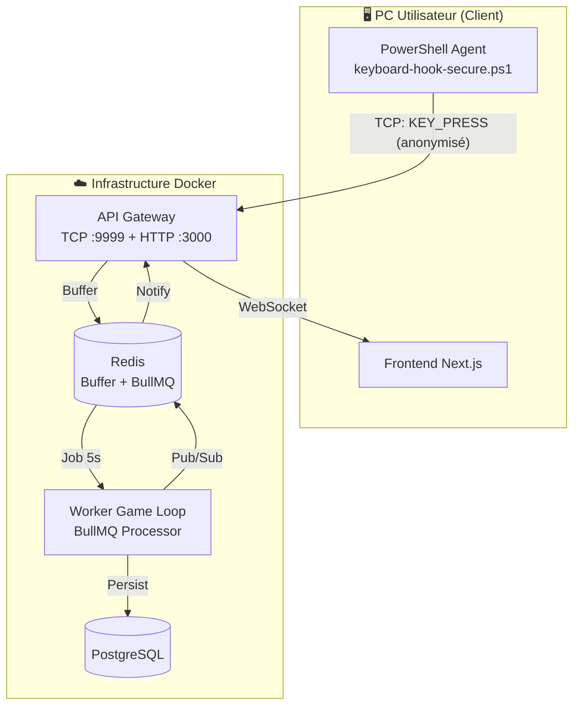

# 🎮 Timeless-Heroes

## Dev-Idle Terminal Game Backend

Un jeu de type Idle/Clicker sur le thème du développement informatique, avec un backend NestJS hautement scalable utilisant BullMQ, Redis, et PostgreSQL.

> 📚 **Documentation Architecture complète** : voir [docs/ARCHITECTURE.md](docs/ARCHITECTURE.md)

---

## 📋 Table des matières

1. [Architecture](#architecture)
2. [Stack Technique](#stack-technique)
3. [Installation](#installation)
4. [Keylogger Sécurisé](#keylogger-sécurisé)
5. [Services](#services)
6. [API Reference](#api-reference)
7. [Configuration](#configuration)
8. [Gestion de l'Idempotence](#gestion-de-lidempotence)

---

## 🏗️ Architecture



### Flux de données détaillé

```
┌─────────────────────────────────────────────────────────────────────────────┐
│                                  CLIENTS                                     │
│              (PowerShell Agent / Terminal / Web / Mobile)                    │
└────────────────────────────────────┬────────────────────────────────────────┘
                                     │ TCP :9999 (Keylogger)
                                     │ WebSocket / REST :3000
                                     ▼
┌─────────────────────────────────────────────────────────────────────────────┐
│                            API-GATEWAY (Port 3000 + 9999)                    │
│  ┌──────────────────┐  ┌──────────────────┐  ┌──────────────────────────┐   │
│  │  TCP Ingest ⚡   │  │  WebSocket GW    │  │  Auth Service            │   │
│  │  - Anonymous     │  │  - KEY_PRESS     │  │  - JWT                   │   │
│  │  - Anti-Cheat    │  │  - Balance       │  │  - Sessions              │   │
│  │  - Heuristics    │  │  - Programs      │  │                          │   │
│  └──────────────────┘  └──────────────────┘  └──────────────────────────┘   │
└─────────────────────────────────────┬───────────────────────────────────────┘
                                      │
        ┌─────────────────────────────┼─────────────────────────────────────┐
        │                             │                                     │
        ▼                             ▼                                     ▼
┌───────────────┐           ┌─────────────────┐               ┌─────────────────┐
│    REDIS      │           │   PostgreSQL    │               │    BullMQ       │
│  - Buffers    │           │   (Prisma)      │               │  - Click Buffer │
│  - Leaderboard│           │   - Users       │               │  - Programs     │
│  - Cache      │           │   - Items       │               │  - Offline      │
│  - Pub/Sub    │           │   - Progression │               │  - Achievements │
└───────────────┘           └─────────────────┘               └─────────────────┘
```

---

## 🛠️ Stack Technique

| Composant | Technologie |
|-----------|-------------|
| **Framework** | NestJS (Monorepo) |
| **Base de données** | PostgreSQL + Prisma ORM |
| **Cache & Broker** | Redis (Pub/Sub, Sorted Sets) |
| **File d'attente** | BullMQ |
| **WebSocket** | Socket.IO |
| **TCP Microservice** | NestJS Microservices |
| **Auth** | JWT + Passport |
| **Paiements** | Stripe |
| **Container** | Docker + Docker Compose |
| **Package Manager** | pnpm + Turborepo |

---

## 🔒 Keylogger Sécurisé

Le keylogger PowerShell est **anonymisé** et **authentifié** :

### Sécurité

- ✅ **Anonymisation** : Seule la *catégorie* de touche est envoyée (CHAR, ENTER, TAB...), jamais le code réel
- ✅ **JWT Auth** : Authentification obligatoire avant envoi
- ✅ **Anti-Cheat** : Détection heuristique des bots (variance de timing)

### Utilisation

```powershell
# Obtenir un token JWT depuis le dashboard web
$token = "votre-jwt-token"

# Lancer l'agent sécurisé
./apps/keylogger/keyboard-hook-secure.ps1 -Token $token
```

### Catégories anonymisées

| Catégorie | Description | Bonus LoC |
|-----------|-------------|-----------|
| `CHAR` | Lettres, chiffres | 1 |
| `ENTER` | Fin de ligne | 3 |
| `TAB` | Indentation | 2 |
| `FUNCTION` | F1-F12 | 2 |
| `MODIFIER` | Shift, Ctrl | 1 |

---

## 📦 Installation

### Prérequis
- Node.js 18+
- pnpm 8+
- Docker & Docker Compose
- PostgreSQL 16+ (ou via Docker)
- Redis 7+ (ou via Docker)

### 1. Cloner et installer

```bash
# Cloner le projet
git clone <repository-url>
cd Timeless-Heroes

# Installer les dépendances
pnpm install
```

### 2. Configuration

```bash
# Copier le fichier d'environnement
cp .env.example .env

# Éditer .env avec vos valeurs
```

### 3. Démarrage avec Docker

```bash
# Démarrer l'infrastructure (PostgreSQL, Redis)
docker-compose up -d postgres redis

# Générer le client Prisma
pnpm -F @repo/prisma-client generate

# Appliquer les migrations
pnpm -F @repo/prisma-client migrate:dev

# Démarrer les services en dev
pnpm dev
```

### 4. Démarrage production Docker

```bash
# Construire et démarrer tous les services
docker-compose up -d --build
```

---

## 🔧 Services

### API Gateway (Port 3000)
Point d'entrée principal avec WebSocket et validation des clics.

**WebSocket Events:**
- `KEY_PRESS` - Événement de clic
- `BALANCE_UPDATE` - Mise à jour du solde
- `LEADERBOARD_UPDATE` - Mise à jour du classement
- `PROGRAM_COMPLETED` - Programme terminé
- `OFFLINE_REWARDS` - Récompenses hors-ligne

### SVC-User-Progression (Port 3001)
Gestion de la progression des joueurs et calcul des coûts.

**Formule de coût:**
```
Price = BaseCost × 1.15^AmountOwned
```

### Worker-Game-Loop (Port 3002)
Workers BullMQ pour les programmes et le calcul offline.

**Jobs gérés:**
- `program-completion` - Fin de programme (delayed)
- `offline-calculation` - Calcul AFK

### SVC-Payment (Port 3003)
Gestion des paiements Stripe avec résilience.

**Webhook:** `POST /webhooks/stripe`

---

## 📚 API Reference

### WebSocket Connection

```javascript
const socket = io('ws://localhost:3000/game', {
  auth: {
    token: 'your-jwt-token',
    userId: 'user-123',
    username: 'Player'
  }
});

// Envoyer un clic
socket.emit('KEY_PRESS', {
  timestamp: Date.now(),
  keyType: 'NORMAL' // NORMAL | SPECIAL | FUNCTION
});

// Recevoir le résultat
socket.on('CLICK_PROCESSED', (result) => {
  console.log('LoC earned:', result.finalValue);
  console.log('New balance:', result.newBalance);
  console.log('Critical hit:', result.isCritical);
});
```

### REST Endpoints

```bash
# Get user progression
GET /api/v1/progression/:userId

# Purchase item
POST /api/v1/progression/purchase
{
  "userId": "user-123",
  "itemSlug": "mechanical-keyboard",
  "quantity": 1
}

# Get leaderboard
GET /api/v1/progression/leaderboard/GLOBAL
```

---

## ⚙️ Configuration

| Variable | Description | Défaut |
|----------|-------------|--------|
| `DATABASE_URL` | URL PostgreSQL | - |
| `REDIS_HOST` | Host Redis | localhost |
| `REDIS_PORT` | Port Redis | 6379 |
| `JWT_SECRET` | Secret JWT | - |
| `MAX_CPS` | Max clics/seconde | 20 |
| `STRIPE_SECRET_KEY` | Clé Stripe | - |

---

## 🔐 Gestion de l'Idempotence (Paiements)

### Problématique
Empêcher qu'un paiement soit crédité plusieurs fois en cas de:
- Webhook Stripe reçu en double
- Retry du job BullMQ après échec
- Crash pendant le provisioning

### Solution Implémentée

```
┌─────────────────────────────────────────────────────────────────────┐
│                    FLUX DE TRAITEMENT PAYMENT                        │
└─────────────────────────────────────────────────────────────────────┘

1. Stripe Webhook reçu
         │
         ▼
2. Extraction de l'idempotencyKey depuis metadata
         │
         ▼
3. Création Job BullMQ PROVISION_ORDER
         │
         ▼
┌─────────────────────────────────────────────────────────────────────┐
│                    DANS LE WORKER                                    │
├─────────────────────────────────────────────────────────────────────┤
│                                                                      │
│  4. checkAndLock(idempotencyKey)                                    │
│         │                                                            │
│         ├── Key existe + COMPLETED → Return (déjà traité)           │
│         │                                                            │
│         ├── Key existe + PROCESSING (< 5min) → Return (en cours)    │
│         │                                                            │
│         └── Key n'existe pas OU FAILED → Continuer                  │
│                   │                                                  │
│                   ▼                                                  │
│  5. Set status = PROCESSING (avec TTL 7 jours)                      │
│                   │                                                  │
│                   ▼                                                  │
│  6. provisionOrder() - Créditer l'utilisateur                       │
│         │                                                            │
│         ├── Succès → markCompleted() → status = COMPLETED           │
│         │                                                            │
│         └── Échec → markFailed() + releaseLock() → BullMQ retry     │
│                                                                      │
└─────────────────────────────────────────────────────────────────────┘
```

### Clés Redis Utilisées

```
idempotency:{key}     → Record { status, createdAt, transactionId }
lock:payment:{key}    → Distributed lock (30s TTL)
```

### Garanties

1. **At-Most-Once Delivery**: Un paiement ne peut être crédité qu'une seule fois
2. **Recovery**: Si un worker crash pendant PROCESSING (> 5min), le retry est autorisé
3. **Audit Trail**: Les records sont conservés 7 jours pour debugging
4. **Distributed Lock**: Empêche les race conditions entre workers

---

## 📊 Schéma de Données Principal

```prisma
model User {
  id            String        @id @default(uuid())
  email         String        @unique
  username      String        @unique
  password      String
  progression   Progression?
  ownedItems    OwnedItem[]
  activePrograms ActiveProgram[]
  transactions  Transaction[]
}

model Progression {
  userId              String   @unique
  linesOfCode         Decimal  @db.Decimal(30, 0)
  clickMultiplier     Float    @default(1.0)
  passiveMultiplier   Float    @default(0.0)
  level               Int      @default(1)
}

model OwnedItem {
  userId      String
  itemId      String
  quantity    Int      @default(1)
  @@unique([userId, itemId])
}

model ActiveProgram {
  userId          String
  programTypeId   String
  startedAt       DateTime
  estimatedEndAt  DateTime
  status          ProgramStatus @default(RUNNING)
  bullJobId       String?
}
```

---

## 🚀 Prochaines Étapes

- [ ] Intégration gRPC pour communication inter-services
- [ ] Système de prestige
- [ ] Événements temporaires
- [ ] Guildes/Équipes
- [ ] Mode compétitif

---

## 📝 License

MIT © Timeless-Heroes Team
