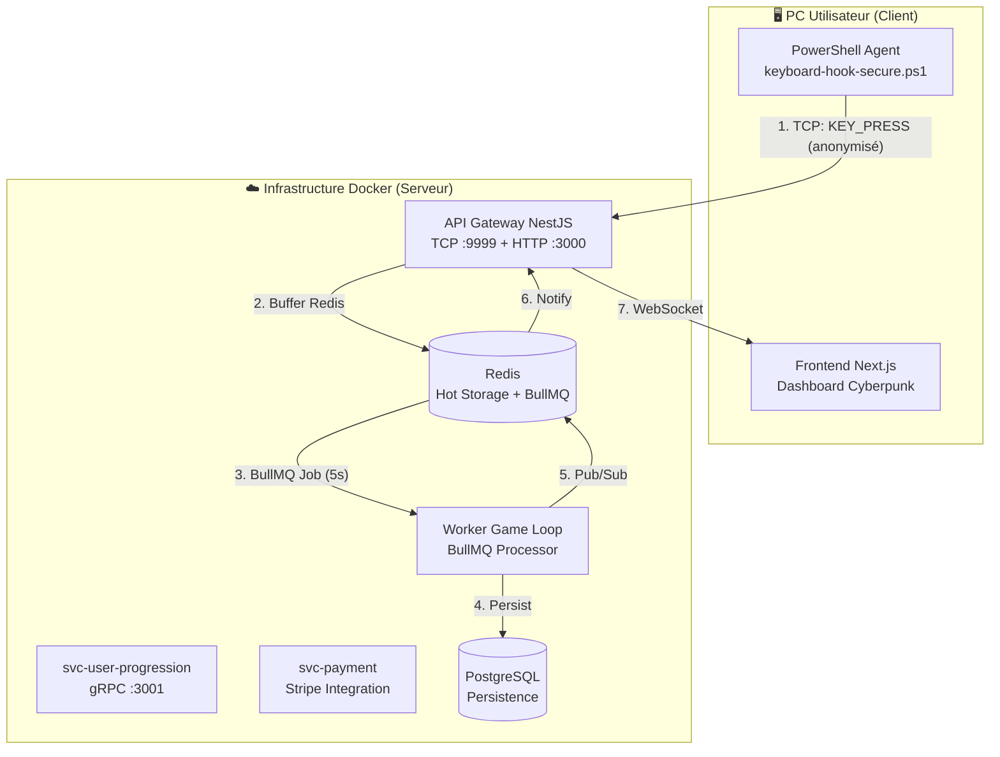

# 🏛️ Architecture Distribuée - Timeless Heroes

## Vue d'ensemble

Ce projet implémente une architecture microservices complète conforme aux exigences du cours :

- ✅ **NestJS** - Framework backend pour tous les services
- ✅ **BullMQ** - Traitement asynchrone des jobs
- ✅ **Redis** - Cache hot storage + Pub/Sub
- ✅ **PostgreSQL** - Persistence avec Prisma ORM
- ✅ **Docker Compose** - Orchestration des services
- ✅ **WebSocket** - Communication temps réel
- ✅ **TCP Microservice** - Ingestion du keylogger

## 📊 Schéma d'Architecture



## 🔒 Sécurité & Privacy

### Anonymisation des touches

**CRITIQUE** : Le script PowerShell ne transmet JAMAIS la touche réelle.

```powershell
# ❌ INTERDIT - Ne jamais envoyer le code touche
writer.WriteLine("KEY:" + vkCode.ToString());  

# ✅ CORRECT - Envoyer uniquement la catégorie
string category = CategorizeKey(vkCode);  # "CHAR", "ENTER", "MODIFIER"...
```

**Catégories anonymisées :**
| Catégorie | Description | Bonus LoC |
|-----------|-------------|-----------|
| `CHAR` | Lettres, chiffres | 1 |
| `ENTER` | Finir une ligne | 3 |
| `TAB` | Indentation | 2 |
| `FUNCTION` | F1-F12 | 2 |
| `MODIFIER` | Shift, Ctrl, Alt | 1 |

### Authentification JWT

```
┌─────────────────┐      ┌──────────────────┐
│ 1. Login Web    │─────>│ API Gateway      │
│    (email/pwd)  │      │                  │
└─────────────────┘      └────────┬─────────┘
                                  │ JWT Token
                                  ▼
┌─────────────────┐      ┌──────────────────┐
│ 2. Start Agent  │─────>│ TCP Ingest       │
│    avec Token   │      │ (auth request)   │
└─────────────────┘      └──────────────────┘
```

## 🛡️ Anti-Cheat Heuristique

Le service `HeuristicAntiCheatService` détecte les comportements robotiques :

### Métriques analysées

1. **Rate de frappe (CPS)** - Max 20 touches/seconde
2. **Variance du timing** - Un humain a une variance > 15ms
3. **Régularité des intervalles** - Un bot a des intervalles constants

### Exemple de détection

```
Humain typique:
  Deltas: [95ms, 112ms, 88ms, 134ms, 76ms]
  StdDev: 21.3ms ✅ HUMAIN

Robot/Script:
  Deltas: [10ms, 10ms, 10ms, 10ms, 10ms]
  StdDev: 0ms ❌ BLOQUÉ
```

## 📦 Write-Behind Pattern (BullMQ)

### Problème
120 mots/minute = 10 touches/seconde = 600 INSERTs/minute 😱

### Solution
```
┌──────────┐     ┌──────────┐     ┌──────────┐     ┌──────────┐
│ Keypress │────>│  Redis   │────>│ BullMQ   │────>│ Postgres │
│ (10/sec) │     │ Buffer   │     │ (5s job) │     │ (1 WRITE)│
└──────────┘     └──────────┘     └──────────┘     └──────────┘
```

**Résultat** : 600 touches → 1 écriture toutes les 5 secondes

## 🐳 Services Docker

| Service | Port | Description |
|---------|------|-------------|
| `api-gateway` | 3000 (HTTP), 9999 (TCP) | Point d'entrée principal |
| `worker-game-loop` | 3002 | Traitement BullMQ |
| `svc-user-progression` | 3001 | Gestion progression |
| `svc-payment` | 3003 | Intégration Stripe |
| `postgres` | 5432 | Base de données |
| `redis` | 6379 | Cache + Queues |

## 🚀 Démarrage

```bash
# Démarrer l'infrastructure
docker-compose up -d postgres redis

# Démarrer les services
docker-compose up -d api-gateway worker-game-loop

# Lancer le client PowerShell (Windows)
./apps/keylogger/keyboard-hook-secure.ps1 -Token "votre-jwt-token"
```

## 📁 Structure des Microservices

```
apps/
├── api-gateway/          # Gateway NestJS (HTTP + WebSocket + TCP)
│   └── src/
│       ├── auth/         # JWT Authentication
│       ├── click-processor/ # Click validation & buffering
│       ├── gateway/      # WebSocket Gateway
│       ├── tcp-ingest/   # TCP Microservice (nouveau!)
│       │   ├── tcp-ingest.controller.ts
│       │   ├── tcp-ingest.service.ts
│       │   └── heuristic-anti-cheat.service.ts
│       └── redis/        # Redis connection
│
├── worker-game-loop/     # BullMQ Workers
│   └── src/
│       ├── click-buffer/ # Redis → PostgreSQL flush (nouveau!)
│       ├── offline-calculator/
│       └── program-processor/
│
├── keylogger/            # Agent Client (Windows)
│   ├── keyboard-hook.ps1         # Version originale (non sécurisée)
│   └── keyboard-hook-secure.ps1  # Version sécurisée (JWT + anonymisation)
│
└── web/                  # Frontend Next.js
```

## ✅ Checklist Conformité Cours

| Critère | Status | Implémentation |
|---------|--------|----------------|
| NestJS Backend | ✅ | api-gateway, worker-game-loop, svc-* |
| BullMQ Async | ✅ | Click buffer, Program completion, Offline calc |
| Redis | ✅ | Buffer, Leaderboards, Pub/Sub, Throttling |
| PostgreSQL | ✅ | Prisma ORM avec migrations |
| Docker | ✅ | docker-compose.yml complet |
| Microservices | ✅ | 4 services découplés |
| WebSocket | ✅ | Real-time game updates |
| Anti-Cheat | ✅ | Heuristic analysis service |
| Sécurité | ✅ | JWT + Anonymisation touches |
