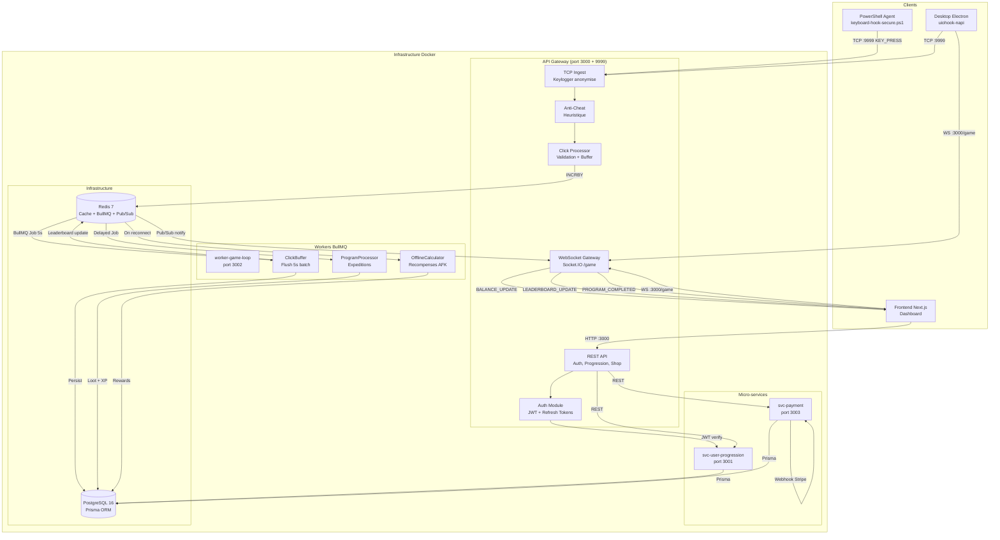

# Architecture du Monorepo Timeless-Heroes

> Document de reference pour l'architecture technique du projet.
> Derniere mise a jour : Mars 2026

---

## 1. Vue d'ensemble

Timeless-Heroes est un jeu incremental (idle/clicker) sur le theme du developpement informatique. L'architecture suit un modele **micro-services** orchestre dans un **monorepo pnpm + Turborepo**.

### Principes architecturaux

- **Separation des responsabilites** : chaque service a un perimetre fonctionnel unique
- **Communication asynchrone** : BullMQ pour les jobs longs, Redis Pub/Sub pour les notifications
- **Write-behind pattern** : les frappes clavier sont bufferisees en Redis puis flushees en batch
- **Scalabilite horizontale** : les workers BullMQ peuvent etre repliques independamment

---

## 2. Cartographie du Monorepo

```
Timeless-Heroes/
├── apps/                          # Applications deployables
│   ├── api-gateway/               # [NestJS] Hub central HTTP/WS/TCP (port 3000 + 9999)
│   ├── svc-user-progression/      # [NestJS] Micro-service progression joueur (port 3001)
│   ├── worker-game-loop/          # [NestJS] Workers BullMQ (port 3002)
│   ├── svc-payment/               # [NestJS] Micro-service paiements Stripe (port 3003)
│   ├── web/                       # [Next.js 16] Frontend web
│   ├── desktop/                   # [Electron + React + Vite] Application desktop
│   ├── keylogger/                 # [Node.js] Agent standalone (legacy)
│   ├── api/                       # [NestJS] Scaffold Turborepo (inutilise)
│   └── worker/                    # Orphelin (a supprimer)
│
├── packages/                      # Librairies partagees
│   ├── prisma-client/             # Schema Prisma + singleton client PostgreSQL
│   ├── redis-client/              # Utilitaires Redis, BullMQ factories, services
│   ├── shared-types/              # Interfaces TypeScript partagees entre services
│   ├── ui/                        # Composants React "Cozy Cyber" design system
│   ├── eslint-config/             # Configuration ESLint flat config
│   ├── typescript-config/         # Presets tsconfig (base, nestjs, nextjs, react-library)
│   ├── jest-config/               # Presets Jest (base, nest, next)
│   ├── api/                       # Scaffold Turborepo (inutilise)
│   └── dtos/                      # Orphelin - sources supprimees, dist/ restant
│
├── docs/                          # Documentation projet
├── docker/                        # Scripts Docker (postgres/init.sql - vide)
└── docker-compose.yml             # Orchestration des 7 services
```

### Elements a nettoyer

| Element          | Raison                                                     |
| ---------------- | ---------------------------------------------------------- |
| `apps/worker/`   | Supersede par `worker-game-loop`, ne contient que `dist/`  |
| `apps/api/`      | Scaffold Turborepo non utilise, tests boilerplate          |
| `packages/api/`  | Scaffold Turborepo, entite `Link` sans rapport avec le jeu |
| `packages/dtos/` | Sources supprimees, namespace `@codetyper/` obsolete       |

---

## 3. Schema de l'infrastructure cible



---

## 4. Detail des services

### 4.1 API Gateway (`apps/api-gateway`)

Point d'entree unique de l'application. Serveur NestJS **hybride** combinant :

| Protocole             | Port         | Usage                 |
| --------------------- | ------------ | --------------------- |
| HTTP/REST             | 3000         | Auth, endpoints API   |
| WebSocket (Socket.IO) | 3000 `/game` | Evenements temps reel |
| TCP                   | 9999         | Ingestion keylogger   |

**Modules implementes :**

- `AuthModule` : Login, register, refresh token rotation (detection de reutilisation), logout, extraction JWT (cookie + Bearer)
- `TcpIngestModule` : Reception TCP des frappes, `HeuristicAntiCheatService` (CPS, variance, ecart-type, regularite)
- `GameGatewayModule` : WebSocket `/game`, evenements KEY_PRESS, BALANCE_UPDATE, LEADERBOARD_UPDATE, PROGRAM_COMPLETED, OFFLINE_REWARDS
- `ClickProcessorModule` : Calcul valeur click (multiplicateurs), buffer Redis (write-behind), rate limiting, validation timestamps
- `PrismaModule` : Client Prisma global
- `RedisModule` : Client Redis global (ClickBuffer, Leaderboard, Throttle, DistributedLock)

### 4.2 svc-user-progression (`apps/svc-user-progression`)

Micro-service dedie a la gestion de la progression des joueurs.

**Responsabilites :**

- Gestion XP et niveaux (scaling 1.5x par niveau)
- Systeme d'achat d'items (6 items, cout exponentiel `BaseCost * 1.15^Owned`)
- Calcul des multiplicateurs (click + passif)
- Leaderboards (global, hebdomadaire, quotidien) via Redis Sorted Sets
- Endpoints REST pour le frontend

**Etat actuel :** Utilise des Maps en memoire. Integration Prisma a faire (TODO dans le code).
**Planifie :** Communication gRPC (code commente dans `main.ts`).

### 4.3 worker-game-loop (`apps/worker-game-loop`)

Workers BullMQ pour le traitement asynchrone.

| Module                    | Queue BullMQ          | Fonction                                                                                                     |
| ------------------------- | --------------------- | ------------------------------------------------------------------------------------------------------------ |
| `ClickBufferModule`       | `click-buffer`        | Flush Redis -> PostgreSQL toutes les 5s (cron). Atomic get-and-clear, detection level-up, update leaderboard |
| `ProgramProcessorModule`  | `program-completion`  | 5 types de programmes (1min a 2h). Loot tables avec drop rates, critical loot (2x), delayed jobs             |
| `OfflineCalculatorModule` | `offline-calculation` | Recompenses AFK : 50% du taux passif, cap 8h (24h premium). Upgrades offline-efficiency, offline-time        |

**Programmes disponibles :**

| Programme            | Duree  | LoC Reward  | XP Reward  |
| -------------------- | ------ | ----------- | ---------- |
| fix_typo             | 1 min  | 50-100      | 10-20      |
| compile_kernel       | 10 min | 500-1000    | 100-200    |
| deploy_microservices | 30 min | 2000-5000   | 500-1000   |
| refactor_legacy      | 1h     | 5000-15000  | 1000-3000  |
| research_ai          | 2h     | 20000-50000 | 5000-10000 |

### 4.4 svc-payment (`apps/svc-payment`)

Micro-service paiements via Stripe.

**Flux :**

1. Webhook Stripe (`POST /webhooks/stripe`) avec verification signature
2. Extraction `idempotencyKey` depuis metadata
3. Creation job BullMQ `PROVISION_ORDER`
4. Worker : `checkAndLock` -> `provisionOrder` -> `markCompleted`

**Garanties :**

- Idempotence via Redis (TTL 7 jours, SHA256)
- Distributed Lock (30s TTL) contre les race conditions
- Recovery : retry autorise apres 5min de PROCESSING
- 5 tentatives avec backoff exponentiel

**Etat actuel :** Stubs pour `PREMIUM_CURRENCY`, `ITEM_PACK`, `SUBSCRIPTION`, `BOOST`.

### 4.5 Frontend Web (`apps/web`)

Next.js 16 avec React 19 et Turbopack.

**Pages implementees :**

- `/login` et `/register` : Auth fonctionnelle (appels API, UI en francais)
- `/dashboard` : Interface gamifiee style IDE (donnees mockees)
- `/game` : Page de jeu avec WebSocket, shop, stats (connecte au keylogger standalone)
- `/` : Page d'accueil (template Turborepo non modifie)

**Infrastructure auth :**

- Middleware Next.js protege toutes les routes (sauf login/register)
- `AuthProvider` React Context
- Fetch wrapper avec retry automatique 401 (refresh token deduplication)

### 4.6 Desktop (`apps/desktop`)

Application Electron avec React + Vite.

**Fonctionnalites :**

- Widget overlay always-on-top (transparent, draggable) avec mascotte `CyberCat`
- Fenetre menu (shop, stats, gestion)
- System tray avec menu contextuel
- Capture globale clavier via `uiohook-napi`
- Revenu passif (boucle 1s)
- Persistance locale via `electron-store`
- IPC bridge securise (preload script)
- Build targets : Windows NSIS, Linux AppImage, macOS DMG

---

## 5. Modeles de donnees (Prisma)

### Schema principal

```
User ──────────── Progression (1:1)
  │                    - linesOfCode (Decimal 30,0)
  │                    - clickMultiplier
  │                    - passiveMultiplier
  │                    - level, xp, prestigeLevel
  │
  ├── OwnedItem[] ──── Item (N:1)
  │                      - name, slug, category
  │                      - baseCost, effectType, effectValue
  │                      - rarity, maxQuantity, levelRequired
  │
  ├── ActiveProgram[] ── ProgramType (N:1)
  │                        - durationMs, category
  │                        - locRewardMin/Max, xpRewardMin/Max
  │                        - lootTable (JSON)
  │
  ├── Transaction[]
  │     - stripePaymentIntentId
  │     - amount, currency, productType
  │     - status, idempotencyKey
  │
  ├── UserAchievement[] ── Achievement (N:1)
  │                          - condition, threshold
  │
  ├── RefreshToken[]
  │     - tokenHash, expiresAt, isRevoked
  │
  └── OfflineSession[]
        - disconnectedAt, reconnectedAt
        - passiveRateAtDisconnect
        - calculatedRewards
```

### Enumerations

| Enum                | Valeurs                                                                                                   |
| ------------------- | --------------------------------------------------------------------------------------------------------- |
| `ItemCategory`      | HARDWARE, SOFTWARE, TEAM, BOOST, COSMETIC                                                                 |
| `EffectType`        | CLICK_MULTIPLIER, PASSIVE_INCOME, CLICK_FLAT, PASSIVE_FLAT, CRITICAL_CHANCE, CRITICAL_MULTIPLIER, SPECIAL |
| `Rarity`            | COMMON, UNCOMMON, RARE, EPIC, LEGENDARY, MYTHIC                                                           |
| `ProgramStatus`     | RUNNING, COMPLETED, FAILED, CANCELLED                                                                     |
| `TransactionStatus` | PENDING, PROCESSING, COMPLETED, FAILED, REFUNDED                                                          |
| `ProductType`       | PREMIUM_CURRENCY, ITEM_PACK, SUBSCRIPTION, BOOST                                                          |

---

## 6. Flux de communication

### 6.1 Flux principal : Frappe clavier -> Persistance

```
1. Client (Desktop/PS Agent) envoie KEY_PRESS via TCP :9999
2. TcpIngestService recoit, anonymise la categorie (CHAR/ENTER/TAB/...)
3. HeuristicAntiCheatService valide (CPS < 20, variance > 15ms)
4. ClickProcessorService calcule la valeur (multiplicateurs, critical)
5. ClickBufferService (Redis) INCRBY atomique sur le buffer utilisateur
6. [Toutes les 5s] Cron job flush : Redis GET+DELETE -> BullMQ job
7. Worker ClickBuffer : persiste en PostgreSQL, met a jour leaderboard
8. Redis Pub/Sub notifie l'API Gateway
9. WebSocket envoie BALANCE_UPDATE au client
```

### 6.2 Flux programmes (expeditions)

```
1. Client demande START_PROGRAM via WebSocket
2. API Gateway cree un ActiveProgram en BDD (status RUNNING)
3. BullMQ delayed job programme pour t+duration
4. A expiration, ProgramProcessor calcule les recompenses + loot
5. ActiveProgram passe en COMPLETED
6. WebSocket envoie PROGRAM_COMPLETED avec les recompenses
```

### 6.3 Flux paiement

```
1. Client initie un checkout Stripe
2. Stripe envoie webhook -> svc-payment POST /webhooks/stripe
3. Verification signature -> extraction idempotencyKey
4. Job BullMQ PROVISION_ORDER cree
5. Worker : lock distribue -> provision -> markCompleted
6. Notification au client
```

### 6.4 Flux offline/AFK

```
1. Client se deconnecte -> OfflineSession cree en BDD
2. Client se reconnecte -> API Gateway detecte
3. OfflineCalculator calcule : duration * passiveRate * 0.5 (cap 8h)
4. Verifie les programmes completes pendant l'absence
5. WebSocket envoie OFFLINE_REWARDS
```

### 6.5 Protocoles utilises

| Communication                   | Protocole                  | Usage                                        |
| ------------------------------- | -------------------------- | -------------------------------------------- |
| Client <-> API Gateway          | HTTP REST                  | Auth, CRUD progression, shop                 |
| Client <-> API Gateway          | WebSocket (Socket.IO)      | Evenements temps reel                        |
| Agent Keylogger <-> API Gateway | TCP brut                   | Ingestion frappes clavier                    |
| API Gateway <-> Workers         | BullMQ (Redis)             | Jobs asynchrones                             |
| API Gateway <-> Micro-services  | HTTP REST (planifie: gRPC) | Delegation metier                            |
| Workers <-> BDD                 | Prisma ORM                 | Persistance                                  |
| Services <-> Redis              | ioredis                    | Cache, buffers, leaderboards, pub/sub, locks |

---

## 7. Infrastructure Docker

### Services definis dans `docker-compose.yml`

| Service                | Image                        | Ports      | Dependances     |
| ---------------------- | ---------------------------- | ---------- | --------------- |
| `postgres`             | postgres:16-alpine           | 5432       | -               |
| `redis`                | redis:7-alpine               | 6379       | -               |
| `redis-commander`      | rediscommander (profile dev) | 8081       | redis           |
| `api-gateway`          | Custom Dockerfile            | 3000, 9999 | postgres, redis |
| `svc-user-progression` | Custom Dockerfile            | 3001       | postgres, redis |
| `worker-game-loop`     | Custom Dockerfile            | 3002       | postgres, redis |
| `svc-payment`          | Custom Dockerfile            | 3003       | postgres, redis |

### Volumes persistants

- `postgres_data` : donnees PostgreSQL
- `redis_data` : donnees Redis (AOF)

### Reseau

- `timeless-network` : reseau Docker partage par tous les services

### Lacune identifiee

Le dossier `docker/postgres/init.sql/` est un repertoire vide. Un script SQL d'initialisation de la base de donnees est requis par le cahier des charges mais n'est pas encore implemente. Ce script devrait contenir la creation du schema initial, les donnees de seed (items, types de programmes, achievements), et les index de performance.
